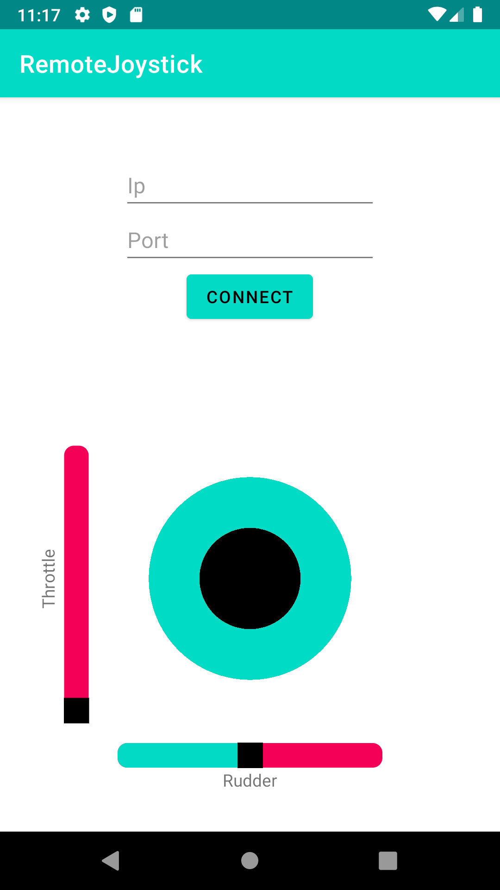

# Remote-Controller-App
Advanced Programming 2 Project



### Summary
This app provides accessible control options to a user wishing to control the flight simulator known as flight gear remotely, by connecting to the flight simulator using a socket and sending appropriate commands to the flight simulator server. The app presents a joystick as well as slide bars to adjust the flight by changing the aileron, elevator, rudder or throttle values of the current flight by utilizing control setting provided by the simulator itself.

### App Features
- [x] An option to connect to any ip and port in order to access the flight gear server with those particular network configurations.
- [x] Throttle and Rudder slide bars, which can be adjusted in order to adjust the flight as well as give visual information as to the state of these variables.
- [x] A joystick which adjusts the Aileron and the Elevator, which can be used to easily guide the plane in the desired direction. Once the users stops moving the joystick, it resets to it's default possition as well as setting Aileron and Elevator to their default values.
- [x] An option to connect to a different run after the first connection by typing in a new pair of ip and port and connecting again.

### Folder Structure
```
├── RemoteJoystick
│   ├── app - contains the source code for the app as well as additional configurations.
│   │   ├── src - contains the source code for the app and test files.
│   │   │   ├── main - contains the source code for the app.
│   │   │   │   ├── java - 
│   │   │   │   │   ├── ... Model - contains the model part of the project, this part communicates with Flightgear.
│   │   │   │   │   ├── ... Model_View - contains the model view part of the project, this part is the middle man between the model and view that adjusts data and │   │   │   │   │   │   │       transfers the data from view to the model.
│   │   │   │   │   ├── ... View - contains the model part of the project.
│   │   │   │   │   │   ├── MainActivity - is responsible for behind the scenes data extraction from xml to be passed on to the model view.
│   │   │   │   │   │   └── Joystick - is responsible for the joystick on the screen.
│   │   │   │   ├── res - 
│   │   │   │   │   ├── layout - the executable file of the application.
│   │   │   │   │   │   ├── activity_main.xml - the xml which is responsable for everything the user sees.
│   │   │   │   │   ├── drawable - holds additional design for seekbars and the app icon.
│   │   │   │   │   └── ... - various folders for graphics.
│   │   │   │   └── AndroidManifest.xml - 
│   │   │   ├── test - contains the source code for the app.
│   │   │   └── androidTest - contains the source code for the app.
│   │   ├── build - contains the images displayed during the execution of the application.
│   │   ├── libs - additional libraries.
│   │   ├── build.gradle - gradle configurations.
│   │   └── proguard-rules.pro - Android Studio assisting files.
│   ├── .gradle - Android Studio assisting files.
│   ├── .idea - Android Studio assisting files.
│   ├── gradle - Android Studio wrapper.
│   ├── build.gradle - gradle configurations.
│   ├── gradle.properties - gradle configurations.
│   ├── gradlew - gradle configurations.
│   ├── gradlew.bat - gradle configurations.
│   ├── local.properties - Android Studio configurations.
│   └── setting.gradle - gradle configurations.
└── plugins - contains the minimal circle dll and linear regression dll files.
```

### Required installations
* FlightGear 2020.3.8 (For windows 7,8,10)
* Android Studio 4.2.1 or higher

### Compiling and Running
1. Download this repository.
2. Open FlightSimulator.exe.
3. Go to setting and add the following configuration line: "--telnet=socket,in,10,127.0.0.1,6400,tcp".
4. Run the code on an Android emulator through Android Studio.
* Alternatively, open the "Build" section in Android Studio then click "Build APK(s)" then run the APK on your phone using developer tools.

### Additional Links
* [UML Diagram](UML.png)
* [App Walkthrough](https://youtu.be/yOPwi-C3aP4)
